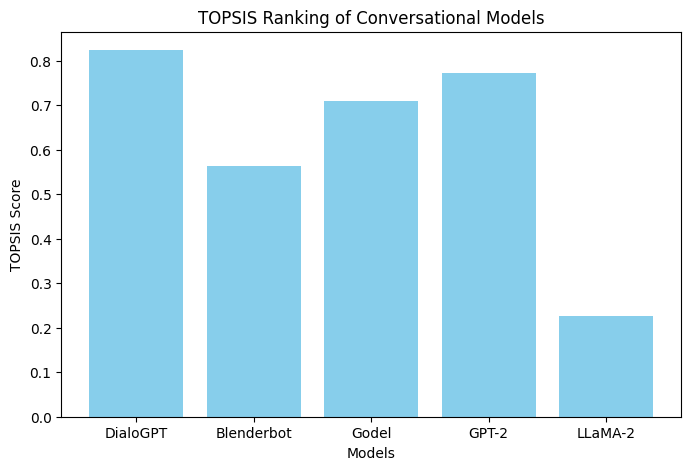

# TOPSIS Conversational Models — Ranking Results

## Overview
This project ranks five conversational models using the TOPSIS multi-criteria decision-making method.

---

## Input Data

**Models Evaluated**
- DialoGPT
- Blenderbot
- Godel
- GPT-2
- LLaMA-2

**Criteria**
- `Model` — Model name
- `Accuracy` — Model accuracy score
- `Speed_Score` — Speed of response
- `Memory_Usage` — Memory consumption (in MB)
- `Human_Score` — Human evaluation score

Input file: [data/conversational_models.csv](data/conversational_models.csv)

---

## Methodology

The TOPSIS method ranks alternatives using these steps:

1. **Normalization** — Normalize the decision matrix
2. **Weighting** — Apply criteria weights
3. **Ideal Points** — Find ideal best and worst solutions
4. **Distance** — Calculate distance from ideal solutions
5. **TOPSIS Score** — Compute preference scores
6. **Ranking** — Rank models by score (higher = better)

**Weights Used**
- Accuracy: 0.30
- Speed Score: 0.25
- Memory Usage: 0.20
- Human Score: 0.25

*Note: Memory Usage is treated as a **cost criterion** (lower is better).*

---

## Results

| Rank | Model | TOPSIS Score |
|------|-------|--------------|
| 1 | DialoGPT | 0.824146 |
| 2 | GPT-2 | 0.773105 |
| 3 | Godel | 0.708741 |
| 4 | Blenderbot | 0.563114 |
| 5 | LLaMA-2 | 0.226895 |

Full results: [results/rankings.csv](rankings.csv)

---

## Visualization

**TOPSIS Scores — Bar Chart**

---

**Outputs:**
- `data/conversational_models.csv` — Input data
- `results/rankings.csv` — TOPSIS results
- `results/graphs.png` — Bar chart visualization

